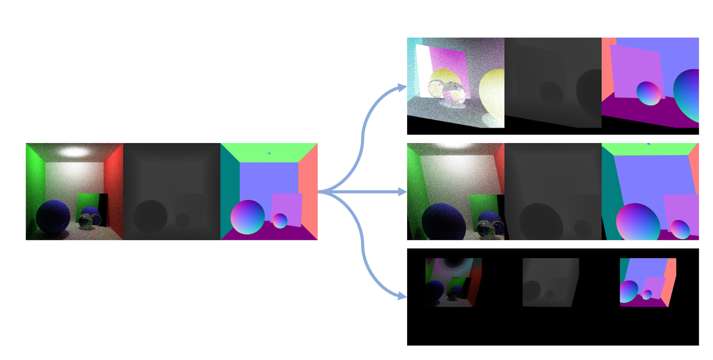

# Augmentation tool
A simple augmentation tool to load, augment and save 3D depth/normal prediction data. This repo contains 17 augmentation 
operations,  and supports [auto-aug](https://arxiv.org/abs/1805.09501) searched augmentation policies.


## Usage
```sh
python3 -m venv env
source env/bin/activate
pip install -r requirements.txt

python src/augment.py \
    --source-dirs ./data/rgb ./data/depth ./data/normal \
    --output-dir ./outputs \
    --count 10 

# Alternatively, you may just run
sh ./scripts/do_augmentation.sh
```

## Features
-  Modularized structure to facilitate configurable pipeline. 
-  17 augmentation operations implemented:

        'Rotate': transform.Rotate,
        'ShearX': transform.ShearX,
        'ShearY': transform.ShearY,
        'TranslateX': transform.TranslateX,
        'TranslateY': transform.TranslateY,
        'AutoContrast': transform.AutoContrast,
        'Invert': transform.Invert,
        'Equalize': transform.Equalize,
        'Mirror': transform.Mirror,
        'Flip': transform.Flip,
        'Solarize': transform.Solarize,
        'Posterize': transform.Posterize,
        'Contrast': transform.Contrast,
        'Color': transform.Color,
        'Brightness': transform.Brightness,
        'Sharpness': transform.Sharpness,
        'RandomResizedCrop': transform.RandomResizedCrop

- Operations, and their sequence & magnitude ranges can be modified by a standalone [config file](https://github.com/CanyonWind/AugTool/blob/main/configs/synthetic_3d_config.py).
- Support Auto Augmentation searched policies when `--pipeline RL_searched` specified. 
- Load and process batch-wise data. Allow data shuffling before loading when `--shuffle-load` specified.
- Photo metric distortions, like `Contrast`, `Color`, `Solarize`,  can be turned on/off for `depth` and `normal` data with `--photo-distort-all` specified or not. Default setting is to only do photo metric distortions on `rgb` data and apply geometry distortions across all sources.

## References
- [Auto Augmentation](https://arxiv.org/abs/1805.09501)
